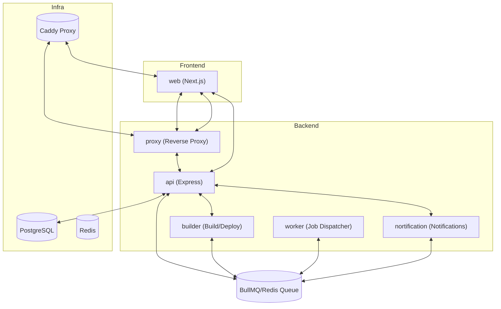

Deploy Your App is structured as a TurboRepo monorepo containing six independent microservices under `apps/`, three shared packages under `packages/`, and a Dockerized infrastructure layer under `infra/`. Each service has a clearly scoped responsibility and communicates with its peers either through HTTP or through BullMQ job queues backed by Redis, so any single service can be scaled, restarted, or replaced without affecting the others.

## Services

| Service | Path | Role |
|---------|------|------|
| web | `apps/web` | Next.js frontend + REST API |
| api | `apps/api` | GitHub webhook handler (Express) |
| builder | `apps/builder` | Build/deploy worker (BullMQ + Docker) |
| worker | `apps/worker` | Job dispatcher (BullMQ) |
| nortification | `apps/nortification` | Notification worker |
| proxy | `apps/proxy` | Reverse proxy (Express + http-proxy) |

## Infrastructure

| Component | Version | Purpose |
|-----------|---------|---------|
| PostgreSQL | 16 | Primary data store, accessed via Prisma ORM |
| Redis | 7 | BullMQ queue backend + pub/sub channel for live build logs |
| Caddy | latest | TLS termination and reverse proxy frontend |

All three infrastructure services are defined in the root `docker-compose.yml` and can be started with a single `docker compose up -d` command during local development.

## Queue Architecture

The platform uses three BullMQ queues, all sharing the `launchdrop` key prefix in Redis. The prefix ensures queue keys are namespaced and do not collide with any other Redis data.

| Queue name | Producer | Consumer | Purpose |
|------------|----------|----------|---------|
| `deployment-queue` | `apps/api` (web API) | `apps/worker` | Receives new deployment jobs when a deploy is triggered |
| `execution-queue` | `apps/worker` | `apps/builder` | Receives dispatched jobs forwarded by the worker |
| `notification-queue` | `apps/api` / `apps/builder` | `apps/nortification` | Delivers notification events (email, Slack, Discord) |

The split between `deployment-queue` and `execution-queue` exists so that the worker process acts as a controlled dispatcher — it can apply throttling or routing logic before forwarding a job to the builder that actually runs Docker.

## Shared Packages

| Package | Path | Contents |
|---------|------|---------|
| `@workspace/database` | `packages/database` | Prisma client, schema, and migrations |
| `@workspace/queue` | `packages/queue` | BullMQ `Queue` instances for all three queues |
| `@workspace/ui` | `packages/ui` | Shared React UI components (shadcn/ui + Tailwind CSS) |

## Data Flow

The diagram below shows how a browser request or a triggered deployment travels through the system end-to-end.

The proxy service resolves an incoming hostname to the most recent successful deployment record in PostgreSQL, then either forwards traffic to the running container over `http://localhost:{port}` (dynamic apps) or fetches static assets from Cloudflare R2 (static Vite apps).

<Note>
TurboRepo orchestrates builds, linting, and type-checking across all apps and packages in dependency order. Running `turbo build` at the repo root compiles shared packages before the services that depend on them, eliminating manual ordering.
</Note>
